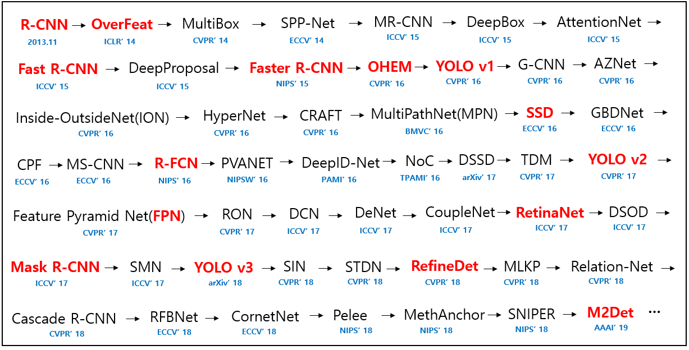
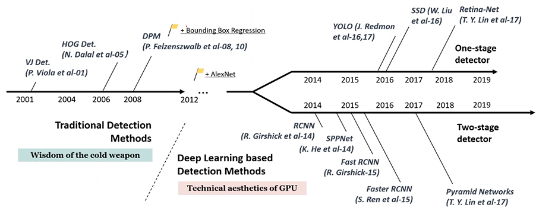

# Paper-Implementation-of-OD
The repository where implementing and studying principal papers in the field of  Object Detection 👨‍💻      

## The History of Object Detection Papers from 2014 to 2019
[Ho_Seong Lee, DL Research Engineer](https://github.com/hoya012) said that
< The part highlighted with red characters means papers that I think "must-read".

However, it is **my personal opinion** and other papers are important too, so I recommend to read them if you have time. >

  

 

  

 
👊

As He mentioned above, I have planned to read through **principal papers first from the beginning (Bottom-Up)👍**. 
And I will go through **from the latest papers of OD to the bottom (Top-Down)👎**

 
👊👊

I will focus on Studying the main idea of the paper and after that, I will try to implement it by code if codes are available. 
Unless codes are available, I will just sum up the concept of the paper. 
When coding, I will put my all into understanding **line by line**.

  
👊👊👊

The ✨latest papers will be updated for sure **after being done with the "Bottom-Up" first.** ✨   
✅ means that this is the paper **I have been done with**       
✏️ means that this is the paper **I have currently been dealing with**      

  

👎**The list below**👎 is the which Object Detection Papers I have planned to go through.   

## Paper List for My Study 

**The Categories 'Review & Code'** stand for a link to what I write down after reading and studying the paper.

|   Detector   | Status  |        Keyword      | Published In |           My Review      |   Code Studied  |   Framework      | Pdf  | 
|:------------:|:-------:|:-------------------:|:------------:|:------------------------:|:---------------:|:----------------:|:----:| 
|     R-CNN    |   ✏️   |          -          |    CVPR'14   |              -           |         -        |          -      |  -    |   
|    SPP-Net   |    -    |          -          |    ECCV'14   |              -           |     -            |         -       |   -   |     
|  Fast R-CNN  |    -    |          -          |    ICCV'15   |              -           |     -            |         -       |   -   |
| Faster R-CNN |    -    |          -          |    NIPS'15   |              -           |     -            |         -       |   -   |
|    YOLO v1   |    -    |          -          |    CVPR'16   |              -           |     -            |         -       |   -   |
|      SSD     |    -    |          -          |    ECCV'16   |              -           |     -            |         -       |   -   |
|     R-FCN    |    -    |          -          |    NIPS'16   |              -           |     -            |         -       |   -   |
|    YOLO v2   |    -    |          -          |    CVPR'17   |              -           |     -            |         -       |   -   |
|      FPN     |    -    |          -          |    CVPR'17   |              -           |     -            |         -       |   -   |
|   RetinaNet  |    -    |          -          |    ICCV'17   |              -           |     -            |         -       |   -   |
|  Mask R-CNN  |    -    |          -          |    ICCV'17   |              -           |     -            |         -       |   -   |
|    YOLO v3   |    -    |          -          |    arXiv'18  |              -           |     -            |         -       |   -   |
|   CenterNet  |    -    |          -          |    ICCV'19   |              -           |     -            |         -       |   -   |
|     FCOS     |    -    |          -          |    ICCV'19   |              -           |     -            |          -      |   -   |
|    YOLO v3   |    -    |          -          |    arXiv'20  |              -           |     -            |         -       |   -   |
| EfficientDet |    -    |          -          |    CVPR'20   |              -           |     -            |         -       |   -   |
|     DETR     |    -    |          -          |    ECCV'20   |              -           |                  |         -       |   -   |

    

## Dataset Papers
Copied from [Ho_Seong Lee, DL Research Engineer](https://github.com/hoya012)

Statistics of commonly used object detection datasets. The Table came from [this survey paper](https://arxiv.org/pdf/1809.02165v1.pdf).

<table>
<thead>
  <tr>
    <th rowspan=2>Challenge</th>
    <th rowspan=2 width=80>Object Classes</th>
    <th colspan=3>Number of Images</th>
    <th colspan=2>Number of Annotated Images</th>
  </tr>
  <tr>
    <th>Train</th>
    <th>Val</th>
    <th>Test</th>
    <th>Train</th>
    <th>Val</th>
  </tr>
</thead>
<tbody>

<!-- PASCAL VOC Object Detection Challenge -->
<tr><th colspan=7>PASCAL VOC Object Detection Challenge</th></tr>
<tr><td> VOC07 </td><td> 20 </td><td> 2,501 </td><td> 2,510 </td><td>  4,952 </td><td>   6,301 (7,844) </td><td>   6,307 (7,818) </td></tr>
<tr><td> VOC08 </td><td> 20 </td><td> 2,111 </td><td> 2,221 </td><td>  4,133 </td><td>   5,082 (6,337) </td><td>   5,281 (6,347) </td></tr>
<tr><td> VOC09 </td><td> 20 </td><td> 3,473 </td><td> 3,581 </td><td>  6,650 </td><td>   8,505 (9,760) </td><td>   8,713 (9,779) </td></tr>
<tr><td> VOC10 </td><td> 20 </td><td> 4,998 </td><td> 5,105 </td><td>  9,637 </td><td> 11,577 (13,339) </td><td> 11,797 (13,352) </td></tr>
<tr><td> VOC11 </td><td> 20 </td><td> 5,717 </td><td> 5,823 </td><td> 10,994 </td><td> 13,609 (15,774) </td><td> 13,841 (15,787) </td></tr>
<tr><td> VOC12 </td><td> 20 </td><td> 5,717 </td><td> 5,823 </td><td> 10,991 </td><td> 13,609 (15,774) </td><td> 13,841 (15,787) </td></tr>

<!-- ILSVRC Object Detection Challenge -->
<tr><th colspan=7>ILSVRC Object Detection Challenge</th></tr>
<tr><td> ILSVRC13 </td><td> 200 </td><td> 395,909 </td><td> 20,121 </td><td> 40,152 </td><td> 345,854 </td><td> 55,502 </td></tr>
<tr><td> ILSVRC14 </td><td> 200 </td><td> 456,567 </td><td> 20,121 </td><td> 40,152 </td><td> 478,807 </td><td> 55,502 </td></tr>
<tr><td> ILSVRC15 </td><td> 200 </td><td> 456,567 </td><td> 20,121 </td><td> 51,294 </td><td> 478,807 </td><td> 55,502 </td></tr>
<tr><td> ILSVRC16 </td><td> 200 </td><td> 456,567 </td><td> 20,121 </td><td> 60,000 </td><td> 478,807 </td><td> 55,502 </td></tr>
<tr><td> ILSVRC17 </td><td> 200 </td><td> 456,567 </td><td> 20,121 </td><td> 65,500 </td><td> 478,807 </td><td> 55,502 </td></tr>

<!-- MS COCO Object Detection Challenge -->
<tr><th colspan=7>MS COCO Object Detection Challenge</th></tr>
<tr><td> MS COCO15 </td><td> 80 </td><td>  82,783 </td><td> 40,504 </td><td> 81,434 </td><td> 604,907 </td><td> 291,875 </td></tr>
<tr><td> MS COCO16 </td><td> 80 </td><td>  82,783 </td><td> 40,504 </td><td> 81,434 </td><td> 604,907 </td><td> 291,875 </td></tr>
<tr><td> MS COCO17 </td><td> 80 </td><td> 118,287 </td><td>  5,000 </td><td> 40,670 </td><td> 860,001 </td><td>  36,781 </td></tr>
<tr><td> MS COCO18 </td><td> 80 </td><td> 118,287 </td><td>  5,000 </td><td> 40,670 </td><td> 860,001 </td><td>  36,781 </td></tr>

<!-- Open Images Object Detection Challenge -->
<tr><th colspan=7>Open Images Object Detection Challenge</th></tr>
<tr><td> OID18 </td><td> 500 </td><td> 1,743,042 </td><td> 41,620 </td><td> 125,436 </td><td> 12,195,144 </td><td> ― </td></tr>

  </tbody>
</table>

The papers related to datasets used mainly in Object Detection are as follows.

- **[PASCAL VOC]** The PASCAL Visual Object Classes (VOC) Challenge | **[IJCV' 10]** | [`[pdf]`](http://host.robots.ox.ac.uk/pascal/VOC/pubs/everingham10.pdf)

- **[PASCAL VOC]** The PASCAL Visual Object Classes Challenge: A Retrospective | **[IJCV' 15]** | [`[pdf]`](http://host.robots.ox.ac.uk/pascal/VOC/pubs/everingham15.pdf) | [`[link]`](http://host.robots.ox.ac.uk/pascal/VOC/)

- **[ImageNet]** ImageNet: A Large-Scale Hierarchical Image Database| **[CVPR' 09]** | [`[pdf]`](http://www.image-net.org/papers/imagenet_cvpr09.pdf)

- **[ImageNet]** ImageNet Large Scale Visual Recognition Challenge | **[IJCV' 15]** | [`[pdf]`](https://arxiv.org/pdf/1409.0575.pdf) | [`[link]`](http://www.image-net.org/challenges/LSVRC/)

- **[COCO]** Microsoft COCO: Common Objects in Context | **[ECCV' 14]** | [`[pdf]`](https://arxiv.org/pdf/1405.0312.pdf) | [`[link]`](http://cocodataset.org/)

- **[Open Images]** The Open Images Dataset V4: Unified image classification, object detection, and visual relationship detection at scale | **[arXiv' 18]** | [`[pdf]`](https://arxiv.org/pdf/1811.00982v1.pdf) | [`[link]`](https://storage.googleapis.com/openimages/web/index.html)

- **[DOTA]** DOTA: A Large-scale Dataset for Object Detection in Aerial Images | **[CVPR' 18]** | [`[pdf]`](https://arxiv.org/pdf/1711.10398v3.pdf) | [`[link]`](https://captain-whu.github.io/DOTA/)

- **[Objects365]** Objects365: A Large-Scale, High-Quality Dataset for Object Detection	| **[ICCV' 19]** | [`[link]`](https://www.biendata.com/competition/objects365/)

